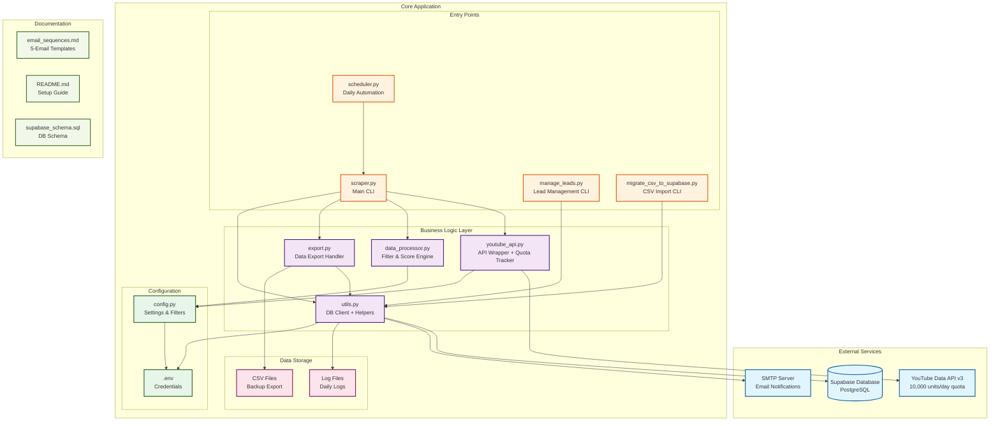
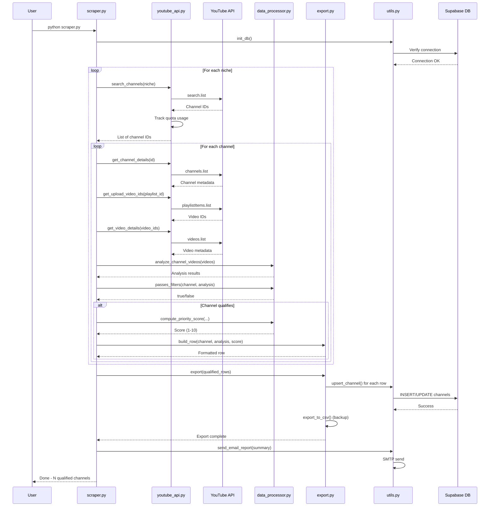
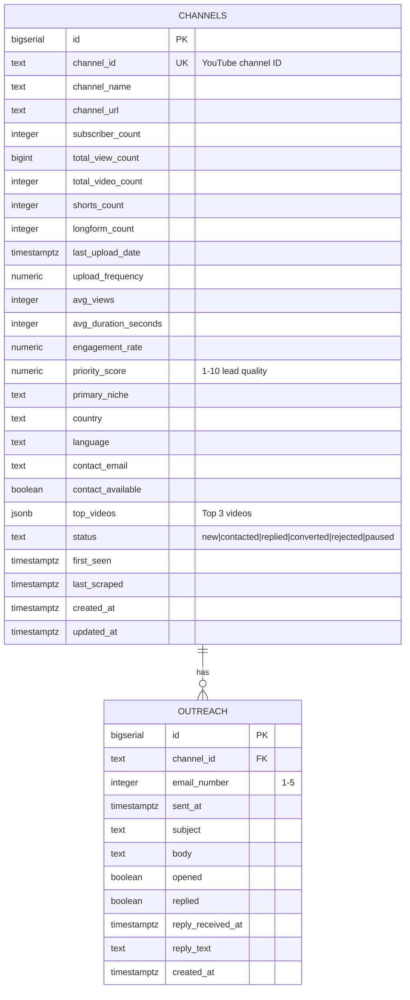
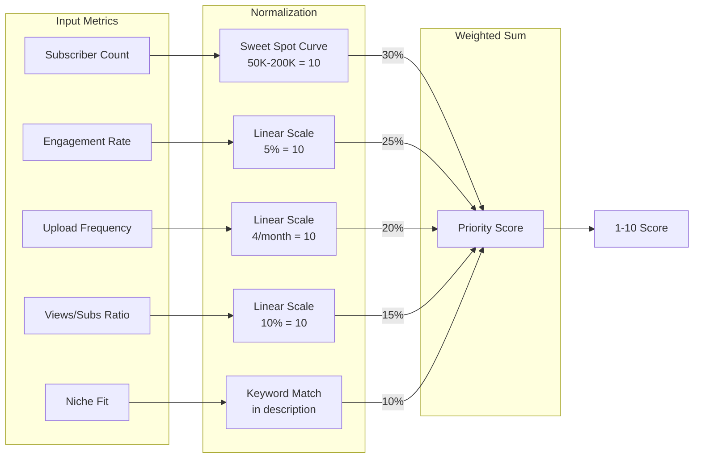
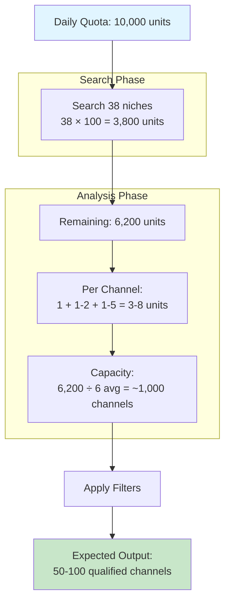
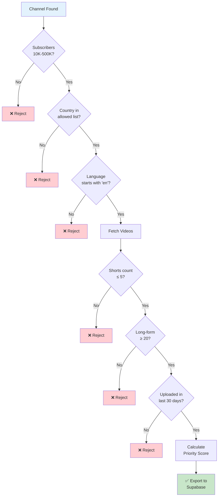
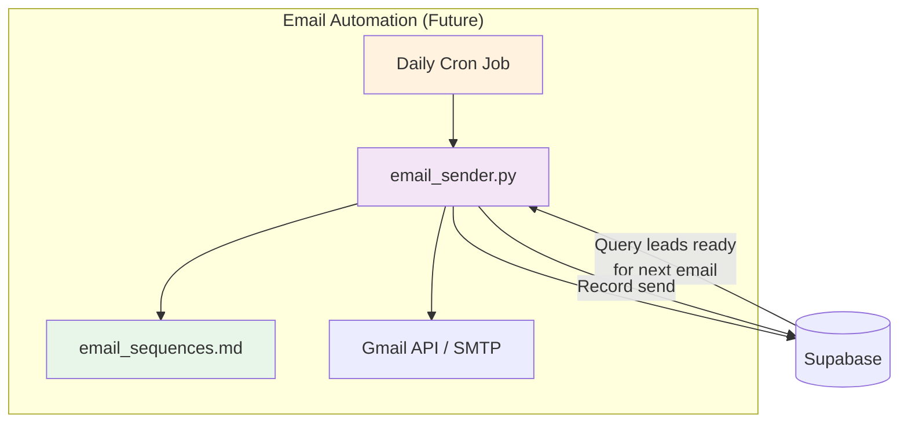

# System Architecture Diagram
**YouTube Channel Scraper for Shorts Repurposing Service**

---

## High-Level Architecture



---

## Detailed Data Flow



---

## Component Breakdown

### 1. Entry Points

| Component | Purpose | Key Functions |
|---|---|---|
| **scraper.py** | Main orchestration - runs full scrape cycle | `run_scrape()`, `main()` |
| **scheduler.py** | Daily automation wrapper | `job()`, runs at 3 AM |
| **manage_leads.py** | CLI for lead management | `list_leads()`, `show_lead()`, `update_lead_status()`, `show_stats()` |
| **migrate_csv_to_supabase.py** | Import existing CSV data | `migrate_csv_file()` |

### 2. Business Logic Layer

| Component | Purpose | Key Functions |
|---|---|---|
| **youtube_api.py** | YouTube API wrapper with quota tracking | `search_channels()`, `get_channel_details()`, `get_upload_video_ids()`, `get_video_details()` |
| **data_processor.py** | Filtering and scoring engine | `analyze_channel_videos()`, `passes_filters()`, `compute_priority_score()` |
| **export.py** | Data export to Supabase + CSV | `export_to_supabase()`, `export_to_csv()`, `build_row()` |
| **utils.py** | Supabase client, logging, helpers | `get_supabase_client()`, `upsert_channel()`, `update_channel_status()`, `send_email_report()` |

### 3. Configuration

| Component | Purpose |
|---|---|
| **config.py** | All settings: filters, niches, weights, paths |
| **.env** | Credentials: YouTube API key, Supabase URL/key, SMTP |

### 4. Data Storage

| Component | Purpose |
|---|---|
| **Supabase** | Primary data store (channels + outreach tables) |
| **CSV Files** | Backup export (leads_YYYYMMDD.csv) |
| **Log Files** | Daily logs (logs/scraper_YYYYMMDD.log) |

---

## Database Schema



---

## Priority Scoring Algorithm



**Formula:**
```
score = (
    subscriber_score * 0.30 +
    engagement_score * 0.25 +
    consistency_score * 0.20 +
    views_ratio_score * 0.15 +
    niche_fit_score * 0.10
)
```

---

## API Quota Management



---

## Filtering Pipeline



---

## Architecture Summary

### 1. Architecture Style
**Monolithic CLI Application** with external service integrations (YouTube API, Supabase, SMTP).

- Single Python codebase
- Modular design with clear separation of concerns
- Stateless execution (all state in Supabase)
- Scheduled batch processing (daily runs)

### 2. Key Components

**Entry Layer:**
- `scraper.py` - Main orchestrator
- `manage_leads.py` - Lead management interface
- `scheduler.py` - Automation wrapper

**Business Logic:**
- `youtube_api.py` - API client with quota tracking
- `data_processor.py` - Filtering and scoring algorithms
- `export.py` - Multi-destination export handler
- `utils.py` - Shared utilities and database client

**Data Layer:**
- Supabase (primary) - PostgreSQL with REST API
- CSV files (backup) - Local timestamped exports
- Log files - Daily operation logs

### 3. Data Flow

1. **Search Phase:** Query YouTube API for channels matching niche keywords
2. **Deduplication:** Check Supabase for existing channel IDs
3. **Analysis Phase:** For each new channel, fetch videos and compute metrics
4. **Filtering Phase:** Apply multi-criteria filters (subscribers, shorts count, activity, etc.)
5. **Scoring Phase:** Calculate 1-10 priority score using weighted algorithm
6. **Export Phase:** Upsert to Supabase + write CSV backup
7. **Notification Phase:** Send email summary (optional)

### 4. Notable Patterns

**Quota Management:**
- Centralized `QuotaTracker` class monitors API usage
- Pre-flight checks before expensive operations
- Graceful degradation when quota exhausted

**Error Handling:**
- Retry logic with exponential backoff for transient failures
- Continue-on-error for individual channel failures
- Comprehensive logging at DEBUG and INFO levels

**Deduplication:**
- Supabase unique constraint on `channel_id`
- In-memory set for fast duplicate checking during run
- Upsert pattern updates existing records on re-scrape

**Configuration:**
- All settings centralized in `config.py`
- Environment-specific values in `.env`
- Easy to adjust filters without code changes

**Extensibility:**
- `outreach` table ready for email automation
- Status field supports workflow states
- Modular design allows adding new export destinations

---

## Future Architecture Considerations

### Email Automation System (Next Phase)



**Design Notes:**
- Separate `email_sender.py` module
- Template rendering with Jinja2 or simple string replacement
- State machine: new → email1 → email2 → ... → email5
- Respect timing gaps (2 days, 4 days, 5 days)
- Rate limiting (50 emails/day per mailbox)
- Reply detection via IMAP (optional)

---

**End of Architecture Document**
